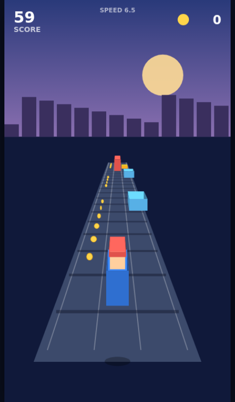

# Dash Runner — an endless runner

A **Subway-Surfers-style** endless runner game (模仿地铁跑酷同款), built as a single
self-contained HTML file with the Canvas 2D API — **zero dependencies, no build step**.



## Play

Just open the file in any modern browser:

```bash
# from this directory
open index.html        # macOS
xdg-open index.html    # Linux
# or double-click index.html
```

No install, no server, no network required.

## How to play

Run forever down a three-lane track. Distance and coins build your score, and the
track keeps getting faster. One hit ends the run.

| Action        | Keyboard              | Touch            |
|---------------|-----------------------|------------------|
| Switch lane   | `←` `→` or `A` `D`    | swipe left/right |
| Jump          | `↑` / `W` / `Space`   | swipe up / tap   |
| Slide         | `↓` / `S`             | swipe down       |
| Start / retry | `Enter` or the button | tap the button   |

## Obstacles

- 🟥 **Train** (tall red) — you can't get past it in-lane; **switch lanes**.
- 🟧 **Barrier** (low orange) — **jump** over it.
- 🟦 **Beam** (floating blue) — **slide** under it.
- 🟡 **Coins** — line up with the lane to collect; some arc into the air, so jump for them.

Your best score is saved in the browser (`localStorage`).

## Features

- Pseudo-3D perspective track with converging lanes, moving sleepers and parallax skyline
- Smooth lane-switching, jump physics (gravity) and timed slide
- Procedural obstacle spawner that always leaves at least one safe lane
- Difficulty ramp: speed and obstacle density scale with distance
- Coin arcs, score/coins/speed HUD, screen-shake on crash, persistent high score
- Keyboard **and** touch/swipe controls, responsive canvas that fits any screen

See [`DESIGN.md`](./DESIGN.md) for how it works under the hood.
