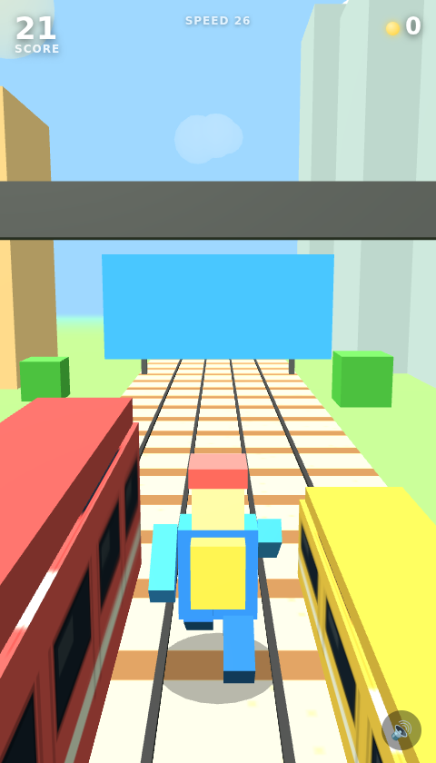
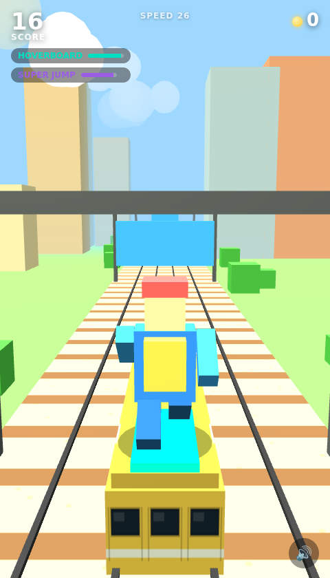

# Dash Runner — an endless runner

A **Subway-Surfers-style** endless runner game (模仿地铁跑酷同款). Comes in **two versions**,
both self-contained and offline — no build step, no server, no network:

| Version | File | Renderer |
|---------|------|----------|
| **3D (flagship)** | [`index-3d.html`](./index-3d.html) | Three.js (WebGL), bundled locally as `three.min.js` |
| **2D (lite)** | [`index.html`](./index.html) | Canvas 2D, zero dependencies |



The 3D version is a faithful Subway-Surfers-style runner set in a bright, sunny
**train yard**: gravel track with wooden sleepers and steel rails, **textured
train cars** (painted windows, doors, livery stripes, headlights), overhead
signal gantries, sun, clouds, bushes and buildings. It opens with a **3-2-1-GO
countdown**, features an animated blocky runner (backpack + cap) with **4
selectable skins**, **glowing coins & power-ups**, a **5-power-up system**
(hoverboard · jetpack · magnet · score ×2 · super-jump), and **synthesized sound
effects & music** (Web Audio, no audio files).

Its signature move: **jump onto the trains and run along the roofs.**



## Play

Just open a file in any modern browser:

```bash
# from this directory
xdg-open index-3d.html   # 3D version (Linux)   ·   open … on macOS
xdg-open index.html      # 2D version
# or double-click the file
```

No install required. The 3D version loads `three.min.js` from the same folder,
so keep the two files together.

## How to play

Run forever down a three-lane track. Distance and coins build your score, and the
track keeps getting faster. One hit ends the run.

| Action        | Keyboard              | Touch            |
|---------------|-----------------------|------------------|
| Switch lane   | `←` `→` or `A` `D`    | swipe left/right |
| Jump          | `↑` / `W` / `Space`   | swipe up / tap   |
| Roll / slide  | `↓` / `S`             | swipe down       |
| Start / retry | `Enter` or the button | tap the button   |
| Mute (3D)     | `M` or the 🔊 button  | tap the 🔊 button |

**Tip:** jump onto a low (yellow) train and you'll land and run along its roof —
then hop back down or onto the next one. Tall (red) trains are too high, so you
must switch lanes for those.

## Power-ups (3D version)

Grab the glowing orbs floating in a lane:

- 🛹 **Hoverboard** — ride a board that shrugs off crashes for its duration (then absorbs one final hit).
- 🚀 **Jetpack** — fly above the yard, sailing over every obstacle while you auto-collect coins.
- 🧲 **Magnet** — pulls nearby coins toward you.
- ✨ **Score ×2** — doubles all points while active.
- 👟 **Super Jump** — jump noticeably higher, making train roofs easy to reach.

Active power-ups show a countdown bar in the HUD. Pick your character skin on the
start screen (saved for next time).

## Obstacles

- 🟥 **Tall train** (red) — too high to mount; **switch lanes**.
- 🟨 **Low train** (yellow) — **jump onto the roof** and run along it, or switch lanes.
- 🟧 **Barrier** (orange) — **jump** over it.
- 🟦 **Signal beam** (blue) — **roll/slide** under it.
- 🟡 **Coins** — line up with the lane to collect; some arc into the air, so jump for them.

Your best score is saved in the browser (`localStorage`).

## Features

- Pseudo-3D perspective track with converging lanes, moving sleepers and parallax skyline
- Smooth lane-switching, jump physics (gravity) and timed slide
- Procedural obstacle spawner that always leaves at least one safe lane
- Difficulty ramp: speed and obstacle density scale with distance
- Coin arcs, score/coins/speed HUD, screen-shake on crash, persistent high score
- Keyboard **and** touch/swipe controls, responsive canvas that fits any screen

See [`DESIGN.md`](./DESIGN.md) for how it works under the hood.
